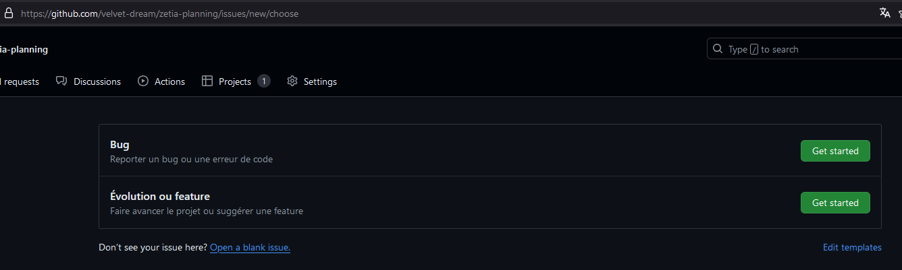
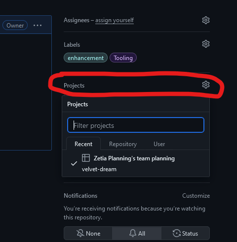
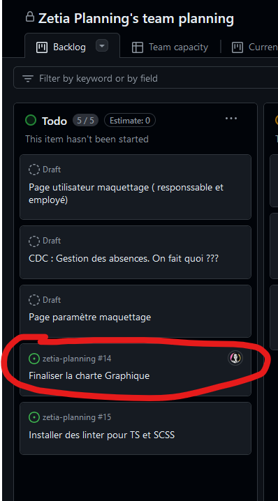
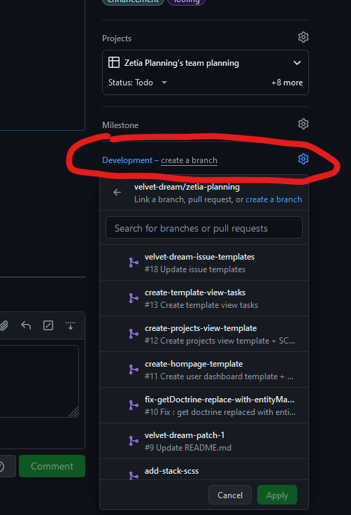

# Contribuer au projet (À lire impérativement)

Nous avons un repository GitHub pour ce projet. Cela implique de se familiariser avec un cetain nombre de termes et de fonctionnements ainsi que de suivre une méthode de travail consistante pour avancer efficacement. Cette doc est là pour ça.

## Les branches

Le projet possède plusieurs branches :
- `main` (protégée) : la branche principale. Elle sert de branche à peu près "sûre" sur laquelle la lead dev pushera personnellement les nouveaux commits depuis `develop` s'ils ne présentent pas de bug à première vue.
- `develop` (protégée) : la branche de développement. **C'est sur elle qu'on travaille !** On ne touche donc jamais à `main` directement.
- les autres branches : celles que l'équipe de développement crée pour avancer sur chaque évolution, feature et correction de bug. Elles devront se baser sur `develop`, ou bien sur d'autres sous-branches de développement.

> Les branches `main` et `develop` sont protégées : cela veut dire que vous aurez besoin d'une review approuvée de la part de la lead dev avant que votre travail soit mergé. Cela permet d'avoir une relecture de son code et de limiter les erreurs et les régressions. Lire la section "Pull Request" pour plus d'info.

### Convention de nommage des branches

Il n'y a pas de convention stricte. Toutefois, vous pouvez vous référer à la convention suivante :
1. Les espaces sont remplacées par des tirets.
2. Auncune majuscule ou caractère accentué.
3. Si la branche se rattache à un ticket, commencer le nom par "fix" suivi du numéro du ticket que la branche est censée fix
    - Si le ticket est une évolution plutôt qu'un bug, le nom commence par "evo" au lieu de "fix"
    - Si la branche ne résout qu'une partie du ticket, son nom peut commencer par le mot-clé "partial-fix"
4. Si elle ne se rattache à aucun ticket, elle peut commencer par "issueless"
5. Le reste du nom doit décrire brièvement ce qu'est censé faire / modifier la branche
6. Utiliser de l'anglais le plus possible

Exemples :
- `fix-#39-login-form-redirects-admins-and-users-differently`
- `partial-fix-#42-style-alert-component`
- `evo-#19-add-colors-and-fonts`
- `issueless-new-queries-in-project-repository`

**Vous n'avez pas obligation stricte de suivre cette convention. Toutefois, le strict minimum est que le nom de la branche soit à peu près descriptif des modifications qu'elle apporte à develop**

## Les PR (Pull Request)

Lorsque vous avez fini une implémentation et que vous voulez ajouter votre travail à `develop`, vous devez faire ce qu'on appelle une *Pull Request*. Pour créer une PR, vous devez partir de votre branche de développement. 3 possibilités s'offrent à vous :

#### 1) GitHub Desktop

Depuis GitHub Desktop, après avoir push tous vos commits, il suffit de cliquer sur ce bouton : 


Assurez-vous bien, sur la fenêtre suivante, de baser votre PR sur une autre branche que `main`.
Cela vous mènera ensuite sur github.com.

#### 2) github.com

Depuis votre branche sur https://github.com/velvet-dream/zetia-planning/, cliquez sur le bouton "Compare & pull request"

Assurez-vous bien de comparer votre PR à la bonne branche (en général, `develop`)

#### 3) commande git

Il existe bien sûr une ligne de commande pour ça. Voir : https://git-scm.com/docs/git-request-pull

-----

### Reviews

Lorsque vous faites une PR sur `develop`, elle ne pourra pas être mergée tout de suite : vous aurez besoin d'une *review* de la part de la lead dev, qui décidera si la PR peut être merged ou s'il y a des modifications à ajouter.

> Concrètement : la lead dev va relire **TOUT VOTRE CODE**.

Si tout est bon, elle s'occupera de merger la PR à develop et d'effacer la branche de développement sur le repo, puisqu'elle aura rempli son rôle.

> Note: l'acronyme LGTM signifie "Looks Good To Me". L'acronyme "RSLGTM" signifique quant à lui "Rubber Stamp Looks Good To Me", il veut dire que la revieweuse n'a pas lu le code en détail mais prend la responsabilité de valider la PR malgré tout.

### Principes importants

Pour fluidifier les reviews et le développement de l'équipe, vos PRs **doivent** suivre deux principes fondamentaux :

#### 1) Separation of concerns (séparation des préoccupations)

Ce principe de développement est essentiel. Une PR ne doit pas dépasser son périmètre. Elle doit se concentrer uniquement sur ce qu'elle a à modifier. Par exemple, une PR qui doit modifier le routing de l'application ne doit pas modifier les styles.

Chaque PR a un rôle et doit s'y tenir. Si votre PR est censée ajouter la fonctionnalité de pouvoir se connecter, elle doit se contenter de faire uniquement ça. Cependant : si, pendant le développement, on se rend compte qu'on a plus à faire que prévu, on peut tout à fait enchaîner plusieurs branches de la sorte :

```
develop <- evo-#22-add-login-form <- evo-#22-login-form-routing-for-users-and-admin <- evo-#22-add-utility-class-to-check-passwords 
```

La première branche est basée sur `develop`. Puisque cette première PR doit attendre d'être review pour être mergée mais qu'il reste du boulot à y faire, on base la branche suivante sur la deuxième, afin de poursuivre le développement et ainsi de suite. Si la PR `evo-#22-add-login-form` venait à être mergée entre temps, la suivante serait automatiquement rebasée sur `develop`.

Ce principe présente deux intérêts majeurs :
1. cela rend les reviews plus petites et plus faciles (plutôt que de modifier 1250 lignes de codes)
2. Si une PR venait à introduire un bug ou une régression, on peut facilement la *revert* (inverser ses modifications) sans faire s'écrouler l'entièreté de l'app.

#### 2) Les petites PR, c'est bien

Évitez à tout prix les énormes PR qui modifient énormément de lignes. Cela rendrait la review impossible et pourrait faire perdre du temps à tout le monde. Subdivisez, autant que possible, vos développements en plusieurs morceaux. Vous pouvez créer autant de branches que vous voulez, après tout. Vous n'êtes pas limité⋅es à avoir une seule branche isolée du genre `mon-prenom-develop` (à vrai dire, j'aimerais ne plus voir ces branches).

## Les Tickets

Les tickets sont un outil essentiel pour faciliter le développement et communiquer avec les autres devs. N'hésitez pas à en faire l'usage ! Vous pouvez même écrire un ticket pour vous servir d'appui pour votre propre développement et ne pas vous disperser. Ils sont visibles à l'adresse suivante : https://github.com/velvet-dream/zetia-planning/issues

Un ticket peut décrire un besoin d'évolution, de nouvelle feature, ou décrire un bug/un problème à fixer.

Il existe pour cela deux templates préfaits. La plupart du temps, si votre ticket ne décrit pas un bug, alors ça sera une "Évolution".



Pour écrire un nouveau ticket, il suffit de cliquer sur "New Issue" depuis https://github.com/velvet-dream/zetia-planning/issues

### Tableau Kanban

Note importante : un ticket peut aussi être mis dans le tableau kanban du projet. Depuis la page d'un ticket, sur la colonne de droite, cliquer sur "Projects" pour ajouter ce ticket au projet github



Ensuite, on retrouve le ticket en question sur le projet :



### Relier un ticket à une PR

On peut également relier un ticket à sa PR pour qu'il soit automatiquement fermé lorsque la PR est mergée.

Deux manières de le faire : 
1. Commencer la description de la PR par le mot-clé "Closes: #numéroDuTicket" (oldschool)
2. Cliquer sur "Development" dans la colonne de droite de votre Ticket ou PR pour y sélectionner la branche / le ticket correspondant.


