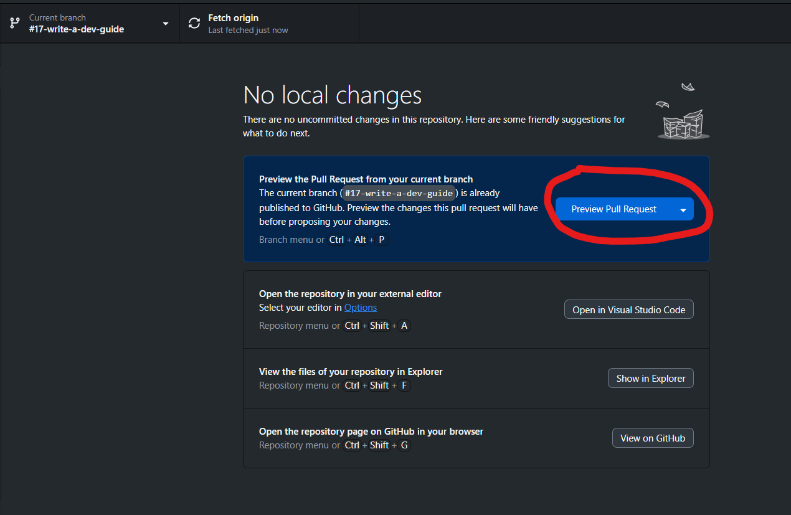

# Contribuer au projet (À lire impérativement)

Nous avons un repository GitHub pour ce projet. Cela implique de se familiariser avec un cetain nombre de termes et de fonctionnements ainsi que de suivre une méthode de travail consistante pour avancer efficacement. Cette doc est là pour ça.

## Les branches

Le projet possède plusieurs branches :
- `main` (protégée) : la branche principale. Elle sert de branche à peu près "sûre" sur laquelle la lead dev pushera personnellement les nouveaux commits depuis `develop` s'ils ne présentent pas de bug à première vue.
- `develop` (protégée) : la branche de développement. **C'est sur elle qu'on travaille !** On ne touche donc jamais à `main` directement.
- les autres branches : celles que l'équipe de développement crée pour avancer sur chaque évolution, feature et correction de bug. Elles devront se baser sur `develop`, ou bien sur d'autres sous-branches de développement.

> Les branches `main` et `develop` sont protégées : cela veut dire que vous aurez besoin d'une review approuvée de la part de la lead dev avant que votre travail soit mergé. Cela permet d'avoir une relecture de son code et de limiter les erreurs et les régressions. Lire la section "Pull Request" pour plus d'info.

### Convention de nommage des branches

Il n'y a pas de convention stricte. Toutefois, vous pouvez vous référer à la convention suivante :
1. Les espaces sont remplacées par des tirets.
2. Auncune majuscule ou caractère accentué.
3. Si la branche se rattache à un ticket, commencer le nom par "fix" suivi du numéro du ticket que la branche est censée fix
    - Si le ticket est une évolution plutôt qu'un bug, le nom commence par "evo" au lieu de "fix"
    - Si la branche ne résout qu'une partie du ticket, son nom peut commencer par le mot-clé "partial-fix"
4. Si elle ne se rattache à aucun ticket, elle peut commencer par "issueless"
5. Le reste du nom doit décrire brièvement ce qu'est censé faire / modifier la branche
6. Utiliser de l'anglais le plus possible

Exemples :
- `fix-#39-login-form-redirects-admins-and-users-differently`
- `partial-fix-#42-style-alert-component`
- `evo-#19-add-colors-and-fonts`
- `issueless-new-queries-in-project-repository`

**Vous n'avez pas obligation stricte de suivre cette convention. Toutefois, le strict minimum est que le nom de la branche soit à peu près descriptif des modifications qu'elle apporte à develop**

## Les PR (Pull Request)

Lorsque vous avez fini une implémentation et que vous voulez ajouter votre travail à `develop`, vous devez faire ce qu'on appelle une *Pull Request*. Pour créer une PR, vous devez partir de votre branche de développement. 3 possibilités s'offrent à vous :

#### 1) GitHub Desktop

Depuis GitHub Desktop, après avoir push tous vos commits, il suffit de cliquer sur ce bouton : 

Assurez-vous bien, sur la fenêtre suivante, de baser votre PR sur une autre branche que `main`.
Cela vous mènera ensuite sur github.com.

#### 2) github.com

Depuis votre branche sur https://github.com/velvet-dream/zetia-planning/, cliquer sur le bouton "Compare & pull request"

Assurez-vous bien de comparer votre PR à la bonne branche (en général, `develop`)

#### 3) commande git

Il existe bien sûr une ligne de commande pour ça. Voir : https://git-scm.com/docs/git-request-pull

### Reviews